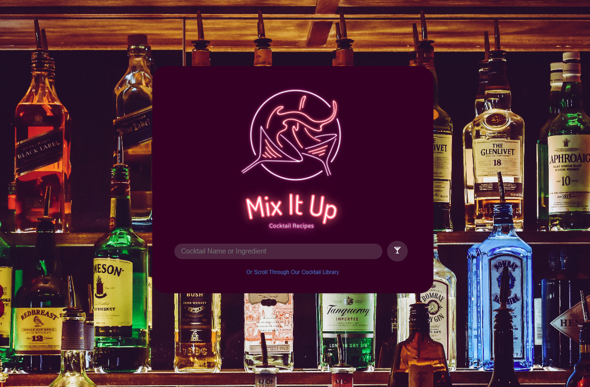
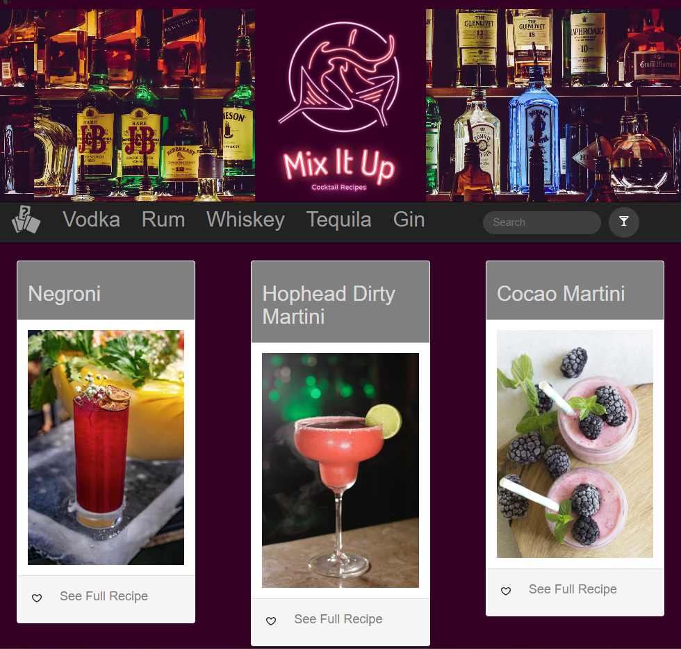
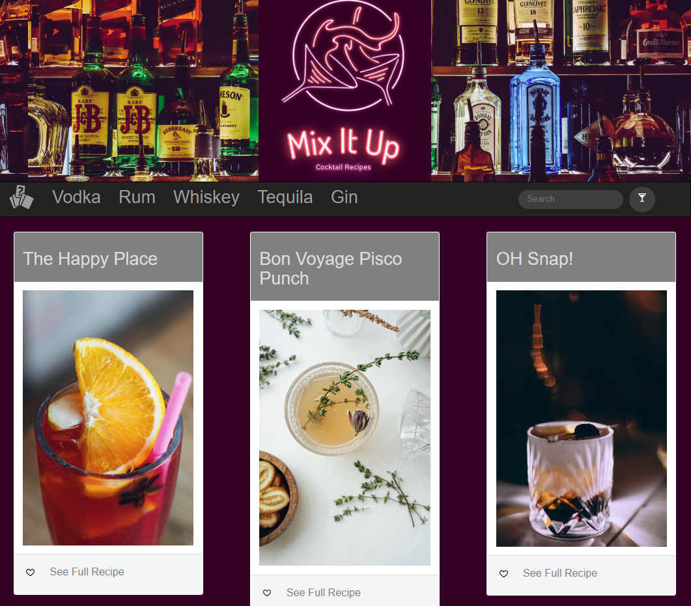
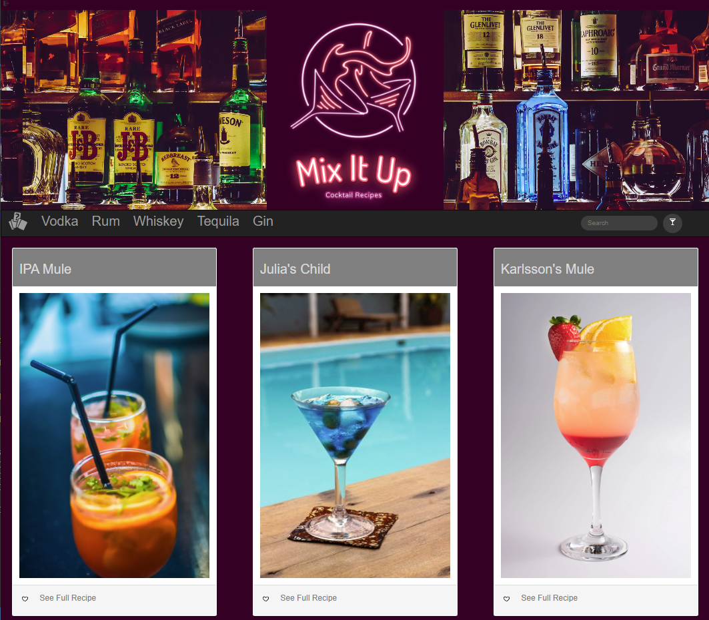
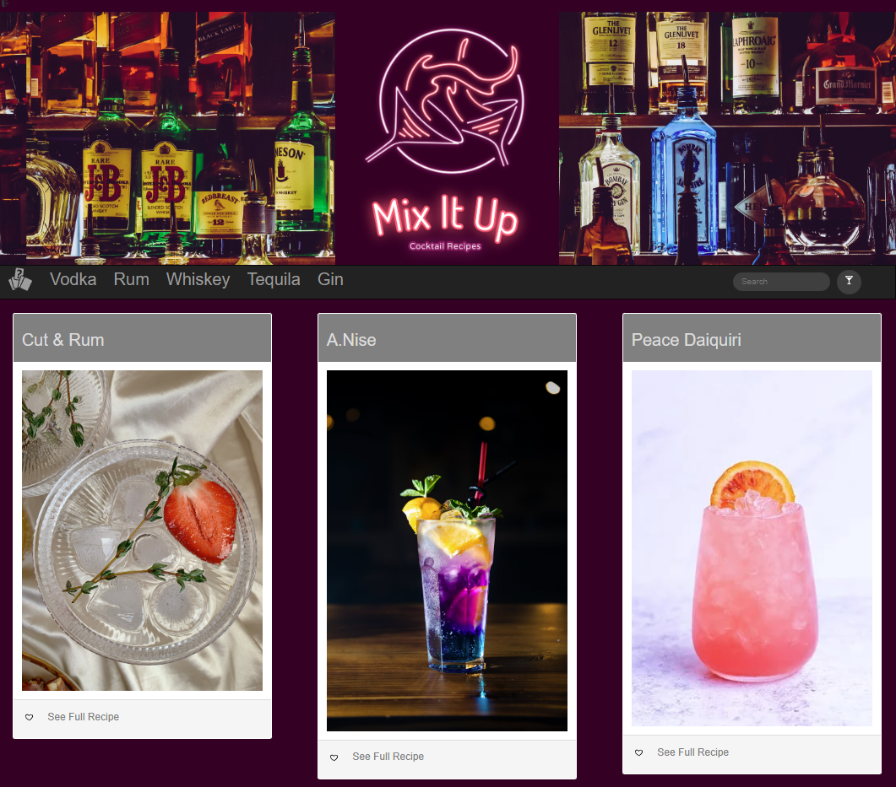
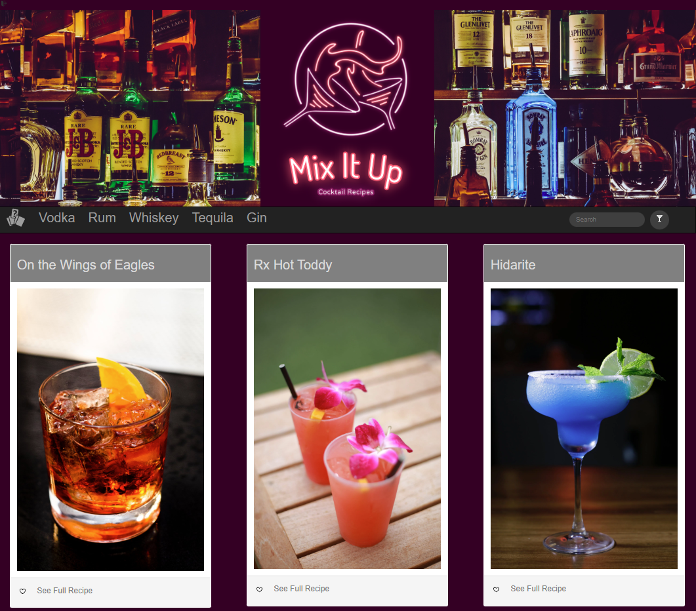
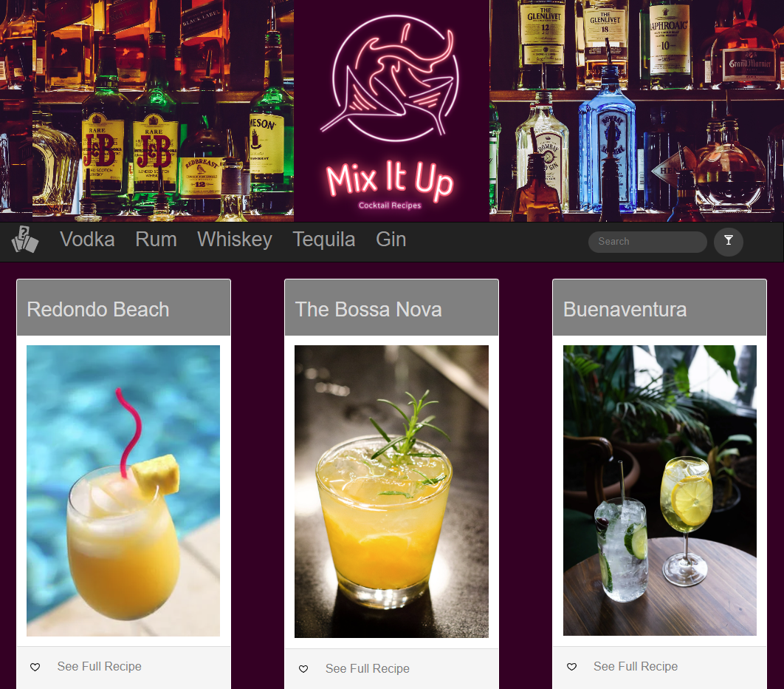
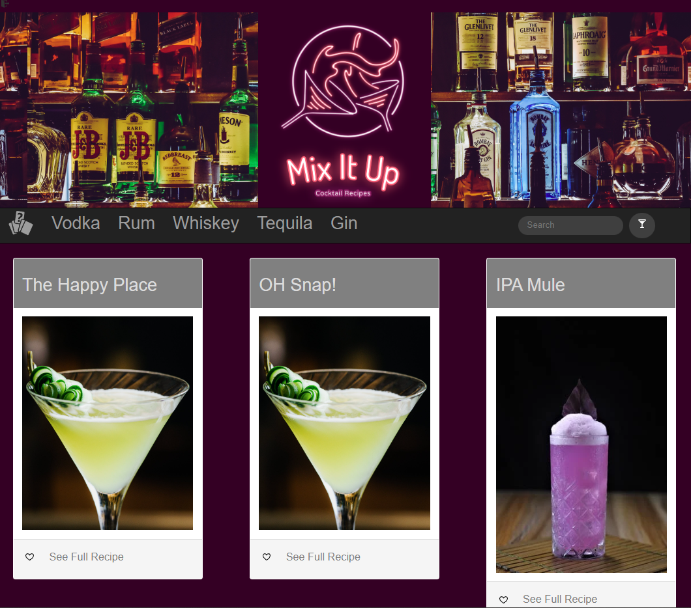
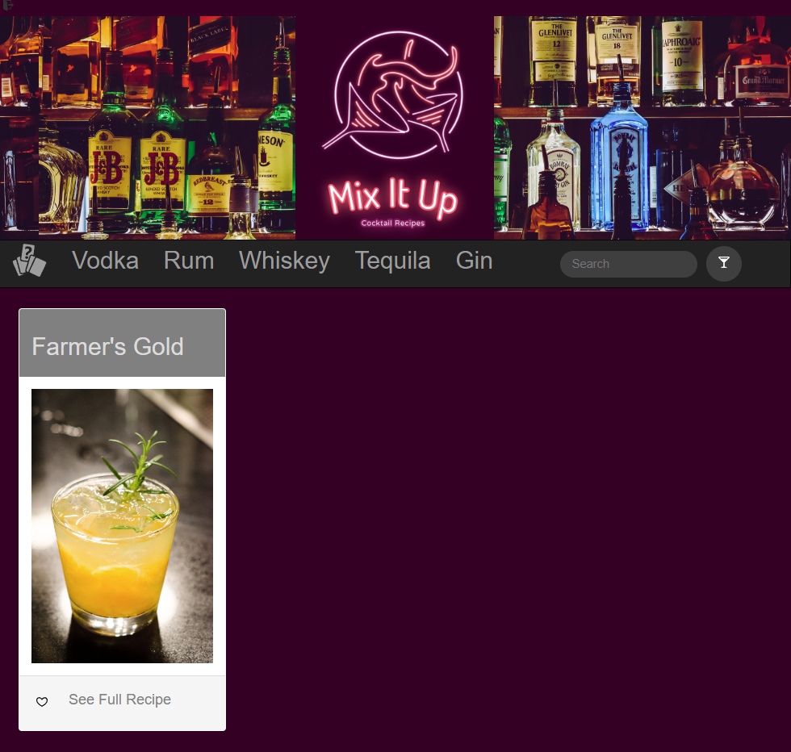

  

# Mix It Up
Project 2, Group 5

## Deployed Link
Heroku Link: https://adadlaldalkmdlka.herokuapp.com/
Github Repo Link: https://github.com/sergeyholin/Project-2

## Inspiration
What cocktails can you make with the ingredients currently in your kitchen? How do you recreate your favorite cocktail at home? We've made an app that can answer both of these questions in just a few clicks.

## Description
Our application Mix It Up allows visitors to the site to search through a database of over six hundred cocktails by name or ingredient in order to find detailed recipes for creating each one.  Visitors are also able to create a profile on the site and login at a later time utilizing those same credentials.

## User Story
- User is presented with a homepage displaying Login & Sign Up buttons

- User is able to sign up for a profile and enter necessary credential information

- Upon sign up, the user is presented with a landing page containing a search bar, a navbar with popular liquor types listed, and a 'Random' button.

- If a user searches by cocktail name, they are presented with a page displaying an image of a cocktail, the name of the cocktail, and a modal with the recipe information

- If a user searches by ingredient, they are presented with a page displaying multiple cards depicting cocktails that contain the input ingredient in the same fashion

- Clicking an option listed on the navbar presents a page that displays cocktails containing the chosen liquor

- Clicking the button on the left with the cards icon displays a single cocktail chosen at random from the database

## Technologies Used
- Bootstrap
- JQuery
- MySQL
- Sequelize
- Node.js
- Express
- Handlebars.js
- Dotenv
- Cocktail Database - https://www.kaggle.com/datasets/shuyangli94/cocktails-hotaling-co

## Contributors
- Sergey Holin - https://github.com/sergeyholin
- Jeffrey Littleton - https://github.com/littletonjeffrey
- Jordan Nadal - https://github.com/jnadal22
- Zach Serrano - https://github.com/ZSerrano

## Future Development
- Attach images that correspond to the cocktails being displayed in the search results
- Create a database that shows the most searched for cocktails on the site
- Update the app with a more unified styling theme
- Expand to hold multiple databases of cocktails that can be pulled from during a search